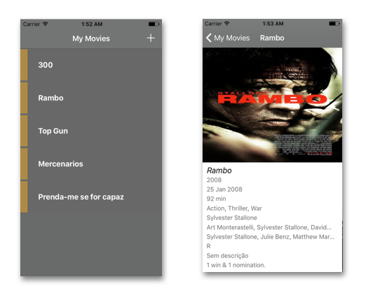

# MyMovies


[](https://github.com/douglastaquary/mymovies/blob/master/LICENSE)

-------
<p align="center">
    <a href="#MyMovies Screens">MyMovies Screens</a> &bull;
    <a href="#motivacao">Motivação</a> &bull;
    <a href="#cobertura">Cobertura de Testes</a> &bull;
    <a href="#instalacao">Instalação</a>
</p>
-------

## MyMovies Screens

<h3 align="center">
  
</h3>

## Motivação

Esse repositório é referente ao protótipo criado para demonstrar o uso do Coredata, framework nativo para persistir dados no iOS 10 e usa a API com informações de filmes [OMDb API](http://www.omdbapi.com) como fonte de busca.

## Instalação

Esse projeto usa [Bundler](http://bundler.io) e [Cocoapods](https://cocoapods.org). Execute os seguintes comandos:
```
bundle
bundle exec pod install
```

## Cobertura de Testes

## License
This project is licensed under the terms of the MIT license. See the LICENSE file.
